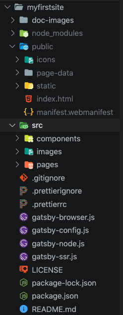
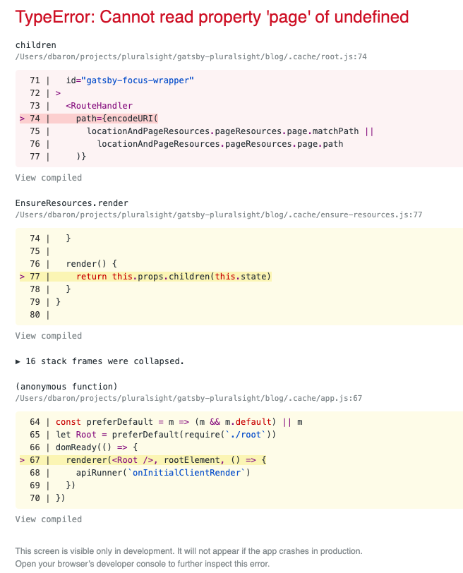

<!-- START doctoc generated TOC please keep comment here to allow auto update -->
<!-- DON'T EDIT THIS SECTION, INSTEAD RE-RUN doctoc TO UPDATE -->
**Table of Contents**  *generated with [DocToc](https://github.com/thlorenz/doctoc)*

- [GatsbyJS: Getting Started](#gatsbyjs-getting-started)
  - [Setup](#setup)
  - [Starter Templates](#starter-templates)
  - [Creating Static Pages](#creating-static-pages)
    - [Understanding Gatsby Pages](#understanding-gatsby-pages)
    - [Create Static Pages](#create-static-pages)
    - [Linking between Pages](#linking-between-pages)
  - [Styling in Gatsby](#styling-in-gatsby)
    - [Understandng CSS in Gatsby](#understandng-css-in-gatsby)
    - [Creating Global Styles](#creating-global-styles)
    - [CSS Modules and SASS](#css-modules-and-sass)
  - [Creating Components](#creating-components)
    - [Understading Components in Gatsby](#understading-components-in-gatsby)
    - [Creating Layout Components](#creating-layout-components)
    - [Creating Sub-components: Header](#creating-sub-components-header)
    - [Creating a Header Link Component](#creating-a-header-link-component)
    - [Creating Home and Social Button components](#creating-home-and-social-button-components)
    - [Creating Sub-components: Footer](#creating-sub-components-footer)
    - [Creating Sub-components: Title](#creating-sub-components-title)
  - [Querying Data with GraphQL](#querying-data-with-graphql)
    - [Intro](#intro)
    - [Adding Site Metadata](#adding-site-metadata)
    - [Getting to Know GraphQL](#getting-to-know-graphql)
    - [Querying Site Metadata with Page Components](#querying-site-metadata-with-page-components)
    - [Querying Site Metadata from a Component](#querying-site-metadata-from-a-component)
  - [Handling Data with Source and Transformer Plugins](#handling-data-with-source-and-transformer-plugins)
    - [Getting Started with Gatsby Plugins](#getting-started-with-gatsby-plugins)
    - [Introducting Gatsby Source Plugins](#introducting-gatsby-source-plugins)
    - [Creating Markdown Files](#creating-markdown-files)
    - [Gatsby Transformer Plugins](#gatsby-transformer-plugins)
    - [Creating Article Components](#creating-article-components)

<!-- END doctoc generated TOC please keep comment here to allow auto update -->

# GatsbyJS: Getting Started

> My notes from this Pluralsight [course](https://app.pluralsight.com/library/courses/gatsbyjs-getting-started/table-of-contents)

## Setup

*VS Code: Disable Beautify plugin for this workspace*

- Install latest [Node.js LTS](https://nodejs.org/en/)
- Install [Gatsby CLI](https://www.gatsbyjs.org/docs/gatsby-cli/) globally:

  ```shell
  $ npm install -g gatsby-cli
  $ gatsby --version
  Gatsby CLI version: 2.8.22 # instructor using 2.4.5
  $ gatsby --help
  Usage: gatsby <command> [options]

  Commands:
    gatsby develop                   Start development server. Watches files, rebuilds, and hot reloads if something changes
    gatsby build                     Build a Gatsby project.
    gatsby serve                     Serve previously built Gatsby site.
    gatsby info                      Get environment information for debugging and issue reporting
    gatsby clean                     Wipe the local gatsby environment including built assets and cache
    gatsby repl                      Get a node repl with context of Gatsby environment, see (https://www.gatsbyjs.org/docs/gatsby-repl/)
    gatsby new [rootPath] [starter]  Create new Gatsby project.
    gatsby plugin                    Useful commands relating to Gatsby plugins
    gatsby telemetry                 Enable or disable Gatsby anonymous analytics collection.

  Options:
    --verbose                Turn on verbose output                                                              [boolean] [default: false]
    --no-color, --no-colors  Turn off the color in output                                                        [boolean] [default: false]
    --json                   Turn on the JSON logger                                                             [boolean] [default: false]
    -h, --help               Show help                                                                                            [boolean]
    -v, --version            Show the version of the Gatsby CLI and the Gatsby package in the current project                     [boolean]
  ```

## Starter Templates

Boilerplate Gatsby sites created by community, come with styles, js, images, etc.

[See all starter templates](https://www.gatsbyjs.org/starters/?v=2).

Search by `gatsby` to see official starters maintained by Gatsby team, eg: `gatsby-starter-default`, `gatsby-starter-blog`.

Each has link to github repo, need this to create a new gatsby project based off this template, eg:

```shell
$ gatsby new myfirstsite git@github.com:gatsbyjs/gatsby-starter-default.git
$ cd myfirstsite
$ gatsby develop
```

Starts dev server at [http://localhost:8000/](http://localhost:8000/)

Starter folder structure:



- `src` folder contains all code related to what's visible in browser
- `src/components` React components that make up site (eg: header.js, image.js, layout.js)
- `src/images` contains site images
- `src/pages` contains pages for the site - also react components, eg: index.js, 404.js, page-2.js
- `gatsby-browser.js` config file, settings affecting the browser
- `gatsby-config.js` main config file - specify metadata about site like title, description. What plugins should be included
- `gatsby-node.js` site build process config

**Gatsby Hello World**

Bare bones to get started, comes with less out of the box compared to gatsby starter

```shell
$ gatsby new blog git@github.com:gatsbyjs/gatsby-starter-hello-world.git
$ cd blog
$ gatsby develop
```

Hot reload used to inject code changes into browser without requiring refresh, try it:

- Notice browser displays `Hello world!`
- Modify `blog/src/pages/index.js`
- Change `world` to `Gatsby` - notice change immediately applied in browser, no refresh needed

## Creating Static Pages

### Understanding Gatsby Pages

Hello world starter comes with just one page: `src/pages/index.js`:

```jsx
import React from "react"

export default () => <div> Hello Gatsby! </div>
```

- All pages import React.
- above example is a functional component, returns JSX
- this is root of site, gets rendered when navigate to `http://localhost:8080`
- if change name of this to `hello.js` then refresh browser, will get dev error:
  
- however, `http://localhost:8000/hello` does render `Hello Gatsby!`

File names imply routing:

| File Name  | Route   |
|---|---|
| index.js  | /  |
| about.js  | /about  |
| contact.js  | /contact  |
| hello.js  | /hello  |

### Create Static Pages

Remove `src/pages/hello.js`

Create `src/pages/index.js`, notice all elements are wrapped in a single `<div>...</div>` element:

```jsx
import React from "react"

export default () => (
  <div>
    <h1>This is the index page</h1>
    <p>
      Lorem ipsum dolor sit amet consectetur adipisicing elit. Voluptatem
      voluptates earum et autem facilis aliquam? Architecto, quibusdam
      dignissimos repellendus harum ipsum eius facilis, necessitatibus
      aspernatur, recusandae non labore magnam tempora?
    </p>
  </div>
)
```

Create `src/pages/about.js` same as index but change title, and `src/pages/404.js`

Gatsby will serve `404.js` for any unmatched route, eg: `http://localhost:8000/missing`

### Linking between Pages

Modify `index.js` to link to Home and About pages:

```jsx
// blog/src/pages/index.js
import React from "react"

export default () => (
  <div>
    <h1>This is the index page</h1>
    <nav>
      <a href="/">Home</a> | <a href="/about">About Me</a>
    </nav>
    <p>
      Lorem ipsum dolor sit amet consectetur adipisicing elit. Voluptatem
      voluptates earum et autem facilis aliquam? Architecto, quibusdam
      dignissimos repellendus harum ipsum eius facilis, necessitatibus
      aspernatur, recusandae non labore magnam tempora?
    </p>
  </div>
)
```

Then add same nav code to `about.js`:

```jsx
import React from "react"

export default () => (
  <div>
    <h1>This is the about page</h1>
    <nav>
      <a href="/">Home</a> | <a href="/about">About Me</a>
    </nav>
    <p>
      Lorem ipsum dolor sit amet consectetur adipisicing elit. Voluptatem
      voluptates earum et autem facilis aliquam? Architecto, quibusdam
      dignissimos repellendus harum ipsum eius facilis, necessitatibus
      aspernatur, recusandae non labore magnam tempora?
    </p>
  </div>
)
```

**Gatsby's Link Component**

Better than html `<a>` tag:
- main component will prefetch route assets as soon as the link appears in browser's viewport
- avoids full page reload using Gatsby's router - faster, better UX
- Use with internal pages only
- Use html `<a>` to link to external pages

Modified index and about pages:

```jsx
// blog/src/pages/about.js
import React from "react"
import { Link } from "gatsby"

export default () => (
  <div>
    <h1>This is the about page</h1>
    <nav>
      <Link to="/">Home</Link> | <Link to="/about">About Me</Link>
    </nav>
    <p>
      Lorem ipsum dolor sit amet consectetur adipisicing elit. Voluptatem
      voluptates earum et autem facilis aliquam? Architecto, quibusdam
      dignissimos repellendus harum ipsum eius facilis, necessitatibus
      aspernatur, recusandae non labore magnam tempora?
    </p>
  </div>
)

// blog/src/pages/index.js
import React from "react"
import { Link } from "gatsby"

export default () => (
  <div>
    <h1>This is the index page</h1>
    <nav>
      <Link to="/">Home</Link> | <Link to="/about">About Me</Link>
    </nav>
    <p>
      Lorem ipsum dolor sit amet consectetur adipisicing elit. Voluptatem
      voluptates earum et autem facilis aliquam? Architecto, quibusdam
      dignissimos repellendus harum ipsum eius facilis, necessitatibus
      aspernatur, recusandae non labore magnam tempora?
    </p>
  </div>
)
```

## Styling in Gatsby

### Understandng CSS in Gatsby

- regular css
- pre-processors (eg: sass, less)
- css-in-js
- css modules (css file in which all class names are scoped locally by default, i.e. namespaced class names to avoid collisions), *supported by Gatsby by default*

**Naming Convention**

- create one css module per component
- componentName.module.css, eg:
  - `index.js` : `index.module.css`
  - `about.js` : `about.module.css`
  - `404.js` : `404.module.css`

Note *kebab-case* used for class names:

```css
/* blog/src/pages/404.module.css */
.header {
  color: red;
}

.error-message {
  font-size: 20px;
  color: green;
}
```

css in module files gets converted to a `styles` object that can be used by the component when imported, eg: `styles.header`, `styles.errorMessage`. Note *camelCase* css class names, and enclosed in curly braces which indicates a javascript expression is to be evaluated in jsx:

```jsx
import React from "react"
import styles from "./404.modules.css"

import React from "react"
import styles from "./404.module.css"

export default () => (
  <div>
    <h1 className={styles.header}>Page not found</h1>
    <p className={styles.errorMessage}>
      The page you are looking for does not exist.
    </p>
  </div>
)
```

### Creating Global Styles

Create new file `src/styles/global.css`:

```css
body {
  font-family: Arial, Helvetica, sans-serif;
  font-size: 17px;
  line-height: 22px;
  margin: 0px;
}
```

Configure Gatsby to tell it about the global styles file in `gatsby-browser.js`:

```javascript
import "./src/styles/global.css"
```

### CSS Modules and SASS

Install Gatsby plugin:

```shell
$ npm install --save node-sass gatsby-plugin-sass
```

Register in `gatsby-config.js`:

```javascript
module.exports = {
  plugins: ["gatsby-plugin-sass"],
}
```

Rename `404.module.css` to `404.module.scss`

Modify to make use of sass feature - nested classes:

```scss
.content {
  background-color: #fafafa;
  padding: 20px;

  .header {
    color: red;
  }

  .error-message {
    font-size: 20px;
    color: gray;
  }
}
```

Modify 404 page to import scss rather than css and make use of parent style:

```jsx
import React from "react"
import styles from "./404.module.scss"

export default () => (
  <div className={styles.content}>
    <h1 className={styles.header}>Page not found</h1>
    <p className={styles.errorMessage}>
      The page you are looking for does not exist.
    </p>
  </div>
)
```

## Creating Components

### Understading Components in Gatsby

3 types of components (all React):

1. Page components
  - `/src/pages/*.js`
  - Represents complete page, with UI and logic.
  - At build time, Gatsby processes jsx in page component into html for browser.
2. Layout components
  - Represents the look of the page
  - Re-used throughout the site
  - Wrapper that contains UI elements that are common to all pages (eg: header, footer)
3. Regular components
  - Building blocks of everything done in Gatsby
  - If have any presentation/logic that needs to be re-used, build it as a regular component.
  - Bundle components together to create larger components

`props` === object with properties that is passed to a React component, supply these to a component to make it dynamic.


### Creating Layout Components

All re-usable components will go in `src/components`.

`props.children` - special property in all props, `children` object can contain arbitrary elements, component can reference `{children}` in jsx to render its children, when it doesn't know ahead of time what those will be:

```css
/* blog/src/components/layout.module.scss */
.container {
  margin: 0 auto;
  max-width: 960px;
  padding: 10px;
}
```

```jsx
// blog/src/components/layout.js
import React from "react"
import styles from "./layout.module.scss"

export default ({ children }) => (
  <div className={styles.container}>{children}</div>
)
```

Use the new layout component in the index page. `children` property in `Layout` component will evaluate to whatever jsx is passed in between the `<Layout>...</Layout>`:

```jsx
// blog/src/pages/index.js
import React from "react"
import { Link } from "gatsby"
import Layout from "../components/layout"

export default () => (
  <Layout>
    <h1>This is the index page</h1>
    <nav>
      <Link to="/">Home</Link> | <Link to="/about">About Me</Link>
    </nav>
    <p>
      Lorem ipsum dolor sit amet consectetur adipisicing elit. Voluptatem
      voluptates earum et autem facilis aliquam? Architecto, quibusdam
      dignissimos repellendus harum ipsum eius facilis, necessitatibus
      aspernatur, recusandae non labore magnam tempora?
    </p>
  </Layout>
)
```

Incorporate `Layout` component in the same way in other pages - about and 404. Also add link back to home page in 404:

```jsx
// blog/src/pages/about.js
import React from "react"
import { Link } from "gatsby"
import Layout from "../components/layout"

export default () => (
  <Layout>
    <h1>This is the about page</h1>
    <nav>
      <Link to="/">Home</Link> | <Link to="/about">About Me</Link>
    </nav>
    <p>
      Lorem ipsum dolor sit amet consectetur adipisicing elit. Voluptatem
      voluptates earum et autem facilis aliquam? Architecto, quibusdam
      dignissimos repellendus harum ipsum eius facilis, necessitatibus
      aspernatur, recusandae non labore magnam tempora?
    </p>
  </Layout>
)

// blog/src/pages/404.js
import React from "react"
import styles from "./404.module.scss"
import Layout from "../components/layout"
import { Link } from "gatsby"

export default () => (
  <Layout>
    <div className={styles.content}>
      <h1 className={styles.header}>Page not found</h1>
      <p className={styles.errorMessage}>
        The page you are looking for does not exist.
      </p>
      <Link to="/">Home</Link>
    </div>
  </Layout>
)
```

### Creating Sub-components: Header

Start with styles and images (content copied over from course exercise materials):

- `blog/src/components/header.module.scss`
- `blog/src/components/header.js`
- `blog/src/styles/global.scss`
- `blog/src/images/github|linkedin|twitter.png`

```jsx
// blog/src/components/header.js
import React from "react"
import { Link } from "gatsby"
import styles from "./header.module.scss"

export default () => (
  <header className={styles.container}>
    <div className={styles.row}>
      <Link to="/">My Gatsby blog</Link>
    </div>

    <div className={styles.row}>
      <Link to="/">BLOG</Link>
      <Link to="/about">ARTICLES</Link>
    </div>
  </header>
)
```

Add header component to layout component:

```jsx
// blog/src/components/layout.js
import React from "react"
import styles from "./layout.module.scss"
import Header from "./header.js"

export default ({ children }) => (
  <div className={styles.container}>
    <Header />
    {children}
  </div>
)
```

Now navigating to root `http://localhost:8000/` and another page `http://localhost:8000/about`, always see the header component because its part of the layout.

### Creating a Header Link Component

Define a `HeaaderLink` component *inside* the `Header` component -> not exported, private, cannot be seen or used outside of Header component.

When using a component, any properties in markup become part of `props` object for component.

```jsx
// blog/src/components/header
import React from "react"
import { Link } from "gatsby"
import styles from "./header.module.scss"

// HeaderLink component
const HeaderLink = props => (
  <Link className={styles.link} to={props.to}>
    {props.text}
  </Link>
)

export default () => (
  <header className={styles.container}>
    <div className={styles.row}>
      <Link to="/">My Gatsby blog</Link>
    </div>

    <div className={styles.row}>
      <HeaderLink to="/" text="ARTICLES" />
      <HeaderLink to="/about" text="ABOUT" />
    </div>
  </header>
)
```

### Creating Home and Social Button components

Replace main link to site with new `HomeButton` component.

Add `SocialButton` component for links to various social media.

```jsx
// blog/src/components/header
import React from "react"
import { Link } from "gatsby"
import styles from "./header.module.scss"

// HeaderLink component
const HeaderLink = props => (
  <Link className={styles.link} to={props.to}>
    {props.text}
  </Link>
)

// HomeButton component
const HomeButton = props => (
  <Link to={props.to}>
    <div className={styles.button}>{props.text}</div>
  </Link>
)

// SocialButton component
const SocialButton = props => {
  let style = ""
  let url = ""

  if (props.site === "twitter") {
    style = styles.buttonTwitter
    url = "https://twitter.com/" + props.username
  } else if (props.site === "linkedin") {
    style = styles.buttonLinkedin
    url = "https://www.linkedin.com/in/" + props.username
  } else if (props.site === "github") {
    style = styles.buttonGithub
    url = "https://www.github.com/" + props.username
  }

  return (
    <a href={url} target="_blank" rel="noopener noreferrer">
      <div className={style}>{props.children}&nbsp;</div>
    </a>
  )
}

export default () => (
  <header className={styles.container}>
    <div className={styles.row}>
      <HomeButton to="/" text="My Gatsby blog" />
      <SocialButton site="github" username="evangeloper"></SocialButton>
      <SocialButton site="linkedin" username="evangeloper"></SocialButton>
      <SocialButton site="twitter" username="evangeloper"></SocialButton>
    </div>

    <div className={styles.row}>
      <HeaderLink to="/" text="ARTICLES" />
      <HeaderLink to="/about" text="ABOUT" />
    </div>
  </header>
)
```

### Creating Sub-components: Footer

Create new footer component, expects special property `children` that is part of `props` object

```jsx
// blog/src/components/footer.js
import React from "react"
import styles from "./footer.module.scss"

export default ({ children }) => (
  <footer className={styles.container}>
    <div className={styles.footer}>{children}</div>
  </footer>
)
```

And corresponding styles for the footer component:

```scss
// blog/src/components/footer.module.scss
@import "../styles/global";

$footer-height: 100px;

.container {
  background-color: $color-pallete-3;
  width: $container-width;
  height: $footer-height;
  position: absolute;
  bottom: 0;
  width: $container-width;

  .footer {
    margin: 0 auto;
    max-width: $site-width;
    height: $footer-height;
    line-height: $footer-height;
    color: $color-pallete-4;
    font-family: Verdana, Geneva, Tahoma, sans-serif;
    padding: 0px 20px 0px 20px;
  }
}
```

Incorporate footer component into the site layout, note that `{children}` in layout is now being wrapped in a div with `content` style. The text specified between the `<Footer>` tag becomes the `children` of Footer component:

```jsx
// blog/src/components/layout.js
import React from "react"
import styles from "./layout.module.scss"
import Header from "./header.js"
import Footer from "./footer.js"

export default ({ children }) => (
  <div className={styles.container}>
    <Header />
    <div className={styles.content}>{children}</div>
    <Footer>My new Gatsby Blog 2019</Footer>
  </div>
)
```

### Creating Sub-components: Title

Create new component for title that renders re-usable title based on `<h1>` tag and optional subtitle.

```jsx
// blog/src/components/title.js
import React from "react"
import styles from "./title.module.scss"

export default props => (
  <section className={styles.container}>
    <h1 className={styles.title}>{props.text}</h1>
    <div className={styles.subtitle}>{props.subtitle}</div>
  </section>
)
```

And corresponding styles:

```scss
// blog/src/components/title.module.scss
@import "../styles/global";

.container {
  padding-bottom: 10px;
  margin-bottom: 30px;
  border-bottom: 5px solid $color-pallete-9;
  text-align: center;
  text-transform: uppercase;
  color: $color-pallete-9;

  .title {
    font-size: 50px;
    line-height: 60px;
  }

  .subtitle {
    font-size: 18px;
    font-weight: 100;
  }
}
```

Modify index and about pages to use title component rather than `<h1>` tag:

```jsx
// blog/src/pages/index.js
import React from "react"
import { Link } from "gatsby"
import Layout from "../components/layout"
import Title from "../components/title"

export default () => (
  <Layout>
    <Title text="Welcome" />
    <nav>
      <Link to="/">Home</Link> | <Link to="/about">About Me</Link>
    </nav>
    <p>
      Lorem ipsum dolor sit amet consectetur adipisicing elit. Voluptatem
      voluptates earum et autem facilis aliquam? Architecto, quibusdam
      dignissimos repellendus harum ipsum eius facilis, necessitatibus
      aspernatur, recusandae non labore magnam tempora?
    </p>
  </Layout>
)

// blog/src/pages/about.js
import React from "react"
import { Link } from "gatsby"
import Layout from "../components/layout"
import Title from "../components/title"

export default () => (
  <Layout>
    <Title text="About Me" />
    <nav>
      <Link to="/">Home</Link> | <Link to="/about">About Me</Link>
    </nav>
    <p>
      Lorem ipsum dolor sit amet consectetur adipisicing elit. Voluptatem
      voluptates earum et autem facilis aliquam? Architecto, quibusdam
      dignissimos repellendus harum ipsum eius facilis, necessitatibus
      aspernatur, recusandae non labore magnam tempora?
    </p>
  </Layout>
)
```

## Querying Data with GraphQL

### Intro

- Data: first class citizen in Gatsby
- GraphQL: Fetch data declaratively from a datasource, specifying what data is needed and format, works very well with React
- Can fetch from variety of datasources including, databases, file system, headless CMS etc.
- Implemented via plugins
- Gatsby uses GraphQL to fetch data at *build time* (built-in behaviour, don't need to write any graphql server yourself)
- Data used to create static resources such as HTML pages
- Also an option - use Gatsby to fetch data at *run time* (use when creating an application)

**Markdown file format**

Gatsby supports reading markdown files as a GraphQL datasource, this will be focus of course because we're building a blog, eg:

```markdown
---
title: "Gatsby is awesome"
date: "2019-01-02
image: "https://tld.com/gatsbyjs.jpg"
keywords: "blog"

# If you are reading this, you know Gatsby is awesome!

Dolore anim duis enim sint elit et dolor pariatur ipsum.
---
```

**Types of Queries**

1. Page Queries
  - runs inside page component (eg: index.js, about.js)
2. Static Queries
  - runs insode non page components (eg: header.js, title.js)

### Adding Site Metadata

Site metadata stored as js object in [gatsby-config.js](blog/gatsby-config.js):

```javascript
// blog/gatsby-config.js
module.exports = {
  siteMetadata: {
    title: "Gatsby blog",
  },
  plugins: ["gatsby-plugin-sass"],
}
```

The `title` in `siteMetadata` should be displayed on every page. Benefit is if this changes, will be automatically reflected in every page on the site.

### Getting to Know GraphQL

Gatsby comes bundled with `GraphiQL` - in browser IDE to explore GraphQL datasources.

After running `gatsby develop`, console shows:

```
View GraphiQL, an in-browser IDE, to explore your site's data and schema
⠀
  http://localhost:8000/___graphql
```

Navigating to this URL - left panel can write GraphQL queries and right panel shows results.

Query to get title property from site metadata:

```graphql
{
  site {
    siteMetadata {
      title
    }
  }
}
```

Result returned in same format as what was requested, note root `data`, this will be inserted into React `props` object and is how components get access to results from graphql queries:

```json
{
  "data": {
    "site": {
      "siteMetadata": {
        "title": "Gatsby blog"
      }
    }
  }
}
```

### Querying Site Metadata with Page Components

Results from previous query, in js object form would be: `data.site.siteMetadata.title`.

To make use of title via GraphQL query in page component, add query, which exposes results in `data` property of `props`, then use it:

```javascript
// blog/src/pages/index.js
import React from "react"
import { Link } from "gatsby"
import Layout from "../components/layout"
import Title from "../components/title"
import { graphql } from "gatsby"

export default ({ data }) => (
  <Layout>
    <Title text={data.site.siteMetadata.title} />
    <nav>
      <Link to="/">Home</Link> | <Link to="/about">About Me</Link>
    </nav>
    <p>
      Lorem ipsum dolor sit amet consectetur adipisicing elit. Voluptatem
      voluptates earum et autem facilis aliquam? Architecto, quibusdam
      dignissimos repellendus harum ipsum eius facilis, necessitatibus
      aspernatur, recusandae non labore magnam tempora?
    </p>
  </Layout>
)

export const query = graphql`
  {
    site {
      siteMetadata {
        title
      }
    }
  }
`
```

### Querying Site Metadata from a Component

Refactor to use title from Header component rather than index Page - need static query component, which accepts two properties: `query` and `render`:

```jsx
import React from "react"
import { Link } from "gatsby"
import styles from "./header.module.scss"
import { StaticQuery, graphql } from "gatsby"

// HeaderLink component
...
// HomeButton component
...
// SocialButton component
...

export default () => (
  <StaticQuery
    query={graphql`
      {
        site {
          siteMetadata {
            title
          }
        }
      }
    `}
    render={data => (
      <header className={styles.container}>
        <div className={styles.row}>
          <HomeButton to="/" text={data.site.siteMetadata.title} />
          <SocialButton site="github" username="evangeloper"></SocialButton>
          <SocialButton site="linkedin" username="evangeloper"></SocialButton>
          <SocialButton site="twitter" username="evangeloper"></SocialButton>
        </div>

        <div className={styles.row}>
          <HeaderLink to="/" text="ARTICLES" />
          <HeaderLink to="/about" text="ABOUT" />
        </div>
      </header>
    )}
  />
)
```

Now HomeButton on all pages is displaying the configured title.

## Handling Data with Source and Transformer Plugins

### Getting Started with Gatsby Plugins

[Plugins site](https://www.gatsbyjs.org/plugins/)

- extend core functionality
- fetch content and data
- transform data (eg: csv to json)
- add third party services (eg: google analytics)
- can also build your own plugin
- packaged as npm modules
- configured in `gatsby-config.js`

### Introducting Gatsby Source Plugins

Fetch data from their source (eg: CMS, local file system, db, api, etc.)

`gatsby-source-filesystem` - read local files from file system, install it with: `npm i --save gatsby-source-filesystem`

Configure:

```javascript
// blog/gatsby-config.js
module.exports = {
  siteMetadata: {
    title: "Gatsby blog",
  },
  plugins: [
    "gatsby-plugin-sass",
    {
      resolve: "gatsby-source-filesystem",
      options: {
        name: "files",
        path: `${__dirname}/src/pages`,
      },
    },
  ],
}
```

Now browse to [GraphiQL](http://localhost:8000/___graphql)

Good practice: Before using plugin in component, write the query in GraphiQL.

This plugin introduces some new nodes that can be queried including `allFile`.

Query to return file info for all files in pages folder (recall plugin is configured with base path pointing to src/pages):

```graphql
{
  allFile {
    edges {
      node {
        id
        name
        ext
        size
      }
    }
  }
}
```

Result:

```json
{
  "data": {
    "allFile": {
      "edges": [
        {
          "node": {
            "id": "8342d730-feb1-5778-ab3e-203f4b16505c",
            "name": "404",
            "ext": ".js",
            "size": 427
          }
        },
        {
          "node": {
            "id": "3a6ae9b3-cda9-53fd-92e7-fb7ffd4eb25f",
            "name": "404.module",
            "ext": ".scss",
            "size": 154
          }
        },
        {
          "node": {
            "id": "66d8a2aa-faea-562e-acaf-7e9c467aab16",
            "name": "about",
            "ext": ".js",
            "size": 594
          }
        },
        {
          "node": {
            "id": "0d02b081-4989-5df2-991b-d5f77bc18f41",
            "name": "index",
            "ext": ".js",
            "size": 593
          }
        }
      ]
    }
  }
}
```

### Creating Markdown Files

- Markdown used to format text documents.
- Easily converted to other formats, usually HTML.
- Create some markdown files as data for the blog, one markdown file === one post.
- Each markdown file with have some metadata and content
- At build time, Gatsby will convert markdown files to static html pages

Create new folder `src/markdown`.

First section of file is *YAML Front Matter* - yet another markup language, metadata, add as many properties as you need in this section. Delimited by `---`

```markdown
<!-- blog/src/markdown/welcome.md -->
---
title: "Welcome to my new Gatsby blog!"
date: "2019-01-01"
image: "https://source.unsplash.com/150x150/?welcome"
keywords: "developers"
---

#Hi there!

**Est culpa fugiat** sint et mollit laboris dolore. Eiusmod qui adipisicing tempor ullamco irure non aliqua commodo proident laboris. Voluptate excepteur laborum anim exercitation Lorem exercitation eu irure voluptate. Et nulla pariatur reprehenderit ea exercitation ex consequat ad fugiat sunt eiusmod. Esse nostrud exercitation non tempor ad ipsum ea quis aute proident proident adipisicing amet. Nostrud esse non Lorem nostrud sunt mollit consectetur veniam quis duis ea anim sint.

##Quis est nisi voluptate

*Quis est nisi voluptate* non id magna voluptate laboris reprehenderit sunt. Sunt est nisi aliquip culpa eiusmod ad occaecat culpa mollit commodo proident eiusmod. Ullamco dolore enim commodo ad esse sit velit ad dolor mollit aute fugiat eu.

##Aliqua et officia

Aliqua et officia ad et dolore pariatur aute sunt ad consequat amet id. Pariatur dolor ex mollit aliquip nisi irure consectetur qui exercitation ut veniam esse. Labore duis aliquip dolore irure minim cupidatat. Veniam consequat elit esse do veniam ullamco id pariatur fugiat aliqua et deserunt. Tempor culpa eu ipsum exercitation proident. Id eiusmod amet labore duis minim veniam eiusmod cillum velit.

###Proident aliqua

Proident aliqua fugiat dolor ut officia officia voluptate elit laborum minim. Officia occaecat est duis amet officia sit eu. Excepteur cupidatat sit laborum mollit aliquip. Sint incididunt dolore incididunt et. Deserunt dolor enim nulla nisi.
```

Add a few more markdown files: `gatsby-awesome.md`, `react-powerful.md` and `graphql-many-datasources.md`

Update filesystem plugin config to point to markdown dir:

```javascript
// blog/gatsby-config.js
module.exports = {
  siteMetadata: {
    title: "Gatsby blog",
  },
  plugins: [
    "gatsby-plugin-sass",
    {
      resolve: "gatsby-source-filesystem",
      options: {
        name: "files",
        path: `${__dirname}/src/markdown`,
      },
    },
  ],
}
```

Run same file query as before to see new results from markdown dir:

```graphql
{
  allFile {
    edges {
      node {
        id
        name
        ext
        size
      }
    }
  }
}
```

New results:

```json
{
  "data": {
    "allFile": {
      "edges": [
        {
          "node": {
            "id": "8b185766-f95e-51a4-97dc-368396923a6e",
            "name": "gatsby-awesome",
            "ext": ".md",
            "size": 1202
          }
        },
        {
          "node": {
            "id": "4b3d5e35-e144-5225-89d9-1717cef7dc74",
            "name": "graphql-many-data-sources",
            "ext": ".md",
            "size": 1927
          }
        },
        {
          "node": {
            "id": "bd221f5a-ae64-5807-9e46-29d3ef51064d",
            "name": "react-powerful",
            "ext": ".md",
            "size": 1406
          }
        },
        {
          "node": {
            "id": "57397a90-6da5-5318-b523-7604d2e22011",
            "name": "welcome",
            "ext": ".md",
            "size": 1600
          }
        }
      ]
    }
  }
}
```

### Gatsby Transformer Plugins

Transform data from one format to another, eg: markdown to json.

Want to create a list of blog posts to be displayed on main page.

`gatsby-transformer-remark` - parses markdown files using Remark, install it: `npm i --save gatsby-transformer-remark`, and configure it:

```javascript
// blog/gatsby-config.js
module.exports = {
  siteMetadata: {
    title: "Gatsby blog",
  },
  plugins: [
    "gatsby-plugin-sass",
    {
      resolve: "gatsby-source-filesystem",
      options: {
        name: "files",
        path: `${__dirname}/src/markdown`,
      },
    },
    "gatsby-transformer-remark",
  ],
}
```

Use GraphiQL to perform a query using nodes from file system source and transformer remark plugins to access markdown file information.

Order by most recent date, transforming markdown data to json

```graphql
{
  allMarkdownRemark(sort:{fields:[frontmatter___date], order:DESC}) {
    totalCount
    edges {
      node {
        id
        frontmatter {
          title
          image
          date(formatString:"MMMM YYYY")
        }
        excerpt
      }
    }
  }
}
```

Results:

```json
{
  "data": {
    "allMarkdownRemark": {
      "totalCount": 4,
      "edges": [
        {
          "node": {
            "id": "128e4c5d-f95a-5053-bc50-5843bbe60882",
            "frontmatter": {
              "title": "One GraphQL, many data sources",
              "image": "https://source.unsplash.com/150x150/?graphql",
              "date": "January 2019"
            },
            "excerpt": "Learn to query multiple data sources with GraphQL Ipsum aliquip aute commodo aliqua qui ex enim anim esse excepteur ex. Veniam cillum et…"
          }
        },
        {
          "node": {
            "id": "3747c7e6-1fd2-5891-9312-39a0ed60f6d8",
            "frontmatter": {
              "title": "React is powerful",
              "image": "https://source.unsplash.com/150x150/?reactjs",
              "date": "January 2019"
            },
            "excerpt": "Learn why React is so powerful Sint voluptate ex anim id ullamco duis quis. Ea excepteur sit ex quis eiusmod culpa nulla in non dolor magna…"
          }
        },
        {
          "node": {
            "id": "f2e4c849-75cb-5977-bec1-03a0f583f61b",
            "frontmatter": {
              "title": "Gatsby is awesome",
              "image": "https://source.unsplash.com/150x150/?gatsbyjs",
              "date": "January 2019"
            },
            "excerpt": "If you are reading this, you know Gatsby is awesome! Dolore anim duis enim sint elit et dolor pariatur ipsum anim dolor et consequat velit…"
          }
        },
        {
          "node": {
            "id": "791fbebf-33ab-57e9-a750-880bde6c8b2a",
            "frontmatter": {
              "title": "Welcome to my new Gatsby blog!",
              "image": "https://source.unsplash.com/150x150/?welcome",
              "date": "January 2019"
            },
            "excerpt": "Hi there! Est culpa fugiat sint et mollit laboris dolore. Eiusmod qui adipisicing tempor ullamco irure non aliqua commodo proident laboris…"
          }
        }
      ]
    }
  }
}
```

Want to use this query on main page `index.js` to display most recent posts. Note that `<article>...</article>` will be rendered once per each markdown file returned by the query:

```javascript
import React from "react"
import { Link } from "gatsby"
import Layout from "../components/layout"
import Title from "../components/title"
import { graphql } from "gatsby"

export default ({ data }) => (
  <Layout>
    <Title text="Welcome" />
    <nav>
      <Link to="/">Home</Link> | <Link to="/about">About Me</Link>
    </nav>
    <p>
      Lorem ipsum dolor sit amet consectetur adipisicing elit. Voluptatem
      voluptates earum et autem facilis aliquam? Architecto, quibusdam
      dignissimos repellendus harum ipsum eius facilis, necessitatibus
      aspernatur, recusandae non labore magnam tempora?
    </p>
    <div className="posts">
      {data.allMarkdownRemark.edges.map(({ node }) => (
        <article>
          <div>
            <strong>{node.frontmatter.title}</strong>
          </div>
          <div>{node.excerpt}</div>
        </article>
      ))}
    </div>
  </Layout>
)

export const query = graphql`
  {
    allMarkdownRemark(sort: { fields: [frontmatter___date], order: DESC }) {
      totalCount
      edges {
        node {
          id
          frontmatter {
            title
            image
            date(formatString: "MMMM YYYY")
          }
          excerpt
        }
      }
    }
  }
`
```

### Creating Article Components

An improvement would be to encapsulate all logic in the `<article>` tag into an `Article` component.

The entire component is clickable (wrapped in Link), url is whatever is defined in `props.to`:

```jsx
// blog/src/components/article.js
import React from "react"
import { Link } from "gatsby"
import styles from "./article.module.scss"

export default props => (
  <Link to={props.to}>
    <article className={styles.articleBox} key={props.id}>
      <div className={styles.left}>
        
      </div>
      <div className={styles.right}>
        <h3>{props.title}</h3>
        <div className={styles.date}>{props.date}</div>
        <div>{props.excerpt}</div>
      </div>
    </article>
  </Link>
)
```

Use article component in index page:

```jsx
import React from "react"
import { Link } from "gatsby"
import Layout from "../components/layout"
import Title from "../components/title"
import { graphql } from "gatsby"
import Article from "../components/article"

export default ({ data }) => (
  <Layout>
    ...
    <div className="posts">
      {data.allMarkdownRemark.edges.map(({ node }) => (
        <Article
          id={node.id}
          to="/"
          keywords={node.frontmatter.keywords}
          title={node.frontmatter.title}
          date={node.frontmatter.date}
          excerpt={node.excerpt}
        />
      ))}
    </div>
  </Layout>
)

export const query = graphql`
  {
    allMarkdownRemark(sort: { fields: [frontmatter___date], order: DESC }) {
      ...
    }
  }
`
```

Further improvement - it's messy for index page to query for markdown, then pass this data to article component.

Create new component `ArticleList` to encapsulate data fetching, and looping over it to render each `Article` component.